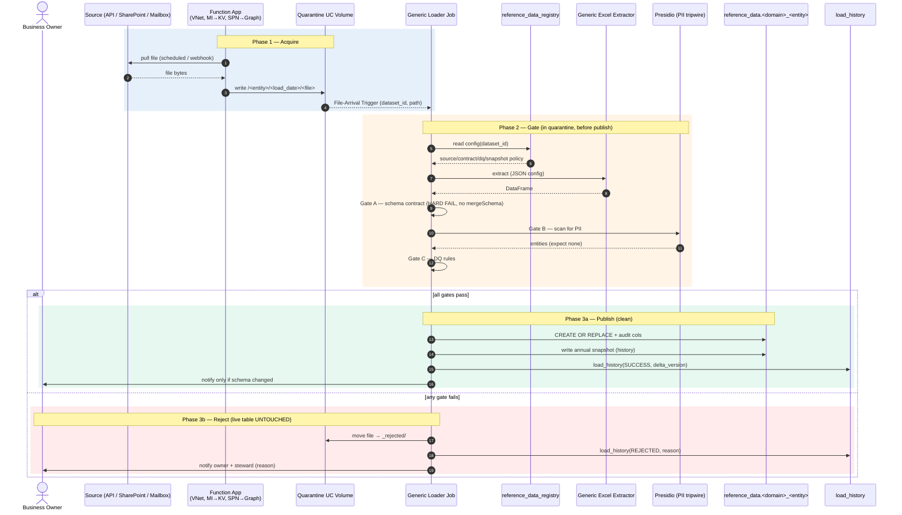
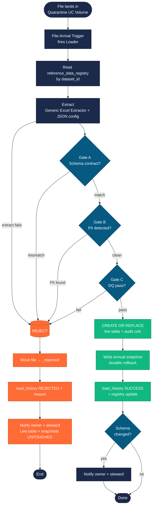

# Reference Data Fast-Track Ingestion — Diagram Prompts (Eraser + Mermaid)

Design: `Reference_Data_Fast_Track_Ingestion_HLD.md`
Three diagrams: (1) Eraser cloud-architecture, (2) Mermaid sequence (gate-before-publish), (3) Mermaid flowchart (decision/lifecycle).
Palette: navy `#1B2A4A`, blue `#065A82`, teal `#1C7293`, cyan `#00B4D8`, green `#10B981`, orange `#FF6B35`, purple `#8B5CF6`.

---

## 1. Eraser.io — Cloud Architecture

Paste into eraser.io (cloud-architecture diagram type).

```eraser
// ============ Reference Data Fast-Track Ingestion — Azure / Databricks ============
title Reference Data Fast-Track Ingestion (DAP)

direction right

// ---- Sources (internet-fronted; see egress exception) ----
group Sources [icon: globe, color: gray] {
  RestApi [label: "REST / JSON API", icon: api]
  SharePoint [label: "SharePoint Online\n(MS Graph)", icon: microsoft-sharepoint]
  Mailbox [label: "Monitored mailbox\n/ manual upload", icon: mail]
}

// ---- Azure landing + acquisition ----
group Azure_DAP [label: "Azure — DAP (Prod UKS)", icon: azure, color: blue] {

  group VNet [label: "VNet  ·  snet-private-endpoints", icon: azure-virtual-networks, color: navy] {
    FunctionApp [label: "Function App\nfunc-dap-refdata-acquire-prd-uks-01\n(MI → Key Vault, SPN → Graph)", icon: azure-function-apps, color: blue]
    KeyVault [label: "Key Vault\nkv-dap-cons-prd-uks-01", icon: azure-key-vaults, color: teal]
  }

  group UC [label: "Unity Catalog — metastore-prd-uks-01  (Delta on UC-managed ADLS Gen2)", icon: databricks, color: teal] {
    Quarantine [label: "QUARANTINE UC Volume\nreference_data_landing.\n<domain>_quarantine_vol\n/<entity>/<load_date>/", icon: azure-data-lake-storage, color: orange]
    Loader [label: "Generic Reference Data Loader\n(ONE parameterized job)\nextract→contract→PII→DQ", icon: databricks, color: navy]
    RefTable [label: "reference_data.\n<domain>_<entity>\n(live Delta table,\nCREATE OR REPLACE)", icon: databricks-delta, color: green]
    Snapshot [label: "<entity>_history\n(annual snapshot Delta table,\ndurable rollback)", icon: databricks-delta, color: green]
    Rejected [label: "_rejected/\n(quarantine Volume)", icon: azure-data-lake-storage, color: red]
  }

  group AppDB [label: "sql-dap-common-prd-uks-01", icon: azure-sql-database, color: blue] {
    Registry [label: "reference_data_registry\n(drives the loader)", icon: table]
    History [label: "reference_data_load_history\n(append-only audit)", icon: table]
  }

  Notify [label: "Notify owner + steward\n(Logic App / ACS)", icon: azure-logic-apps, color: purple]
}

// ---- Flow ----
RestApi > FunctionApp
SharePoint > FunctionApp: "MS Graph (egress exception)"
Mailbox > FunctionApp
KeyVault > FunctionApp: secrets
FunctionApp > Quarantine: write raw file
Quarantine > Loader: "File-Arrival Trigger (no Service Bus)"
Registry > Loader: config (per dataset_id)
Loader > RefTable: "PASS → publish + audit cols"
Loader > Snapshot: "PASS → annual snapshot"
Loader > Rejected: "FAIL → move file"
Loader > History: every attempt (SUCCESS / REJECTED)
Loader > Notify: "REJECT or schema change"
RefTable > Snapshot: inherits mask/lineage (none — non-PII)
```

---

## 2. Mermaid — Sequence (gate-before-publish)



---

## 3. Mermaid — Flowchart (decision / lifecycle)



---

### Render notes
- **Storage distinction (important):** everything in the `UC` group — the quarantine Volume, the live `reference_data.<domain>_<entity>` table, and the `_history` snapshot — is **Delta Lake on UC-managed ADLS Gen2**, governed by Unity Catalog. The **only** Azure SQL Database in this design is `sql-dap-common-prd-uks-01`, holding the governance tables `reference_data_registry` + `reference_data_load_history` (the `AppDB` group). Do not represent the reference tables/snapshots as SQL DB objects.
- Eraser: render in eraser.io; export HD PNG. Icon names are Eraser conventions — `databricks-delta` / `azure-data-lake-storage` may resolve as generic glyphs; swap any that don't resolve (keep the colour + label).
- Mermaid: GitHub/Confluence/Notion native, or via the Mermaid renderer for HD PNG (deviceScaleFactor 2, §8).
- Sequence uses `autonumber` + `rect` phase blocks per the §8 deliverable pattern; flowchart colour-codes pass (green) / gate (blue) / reject (orange).
